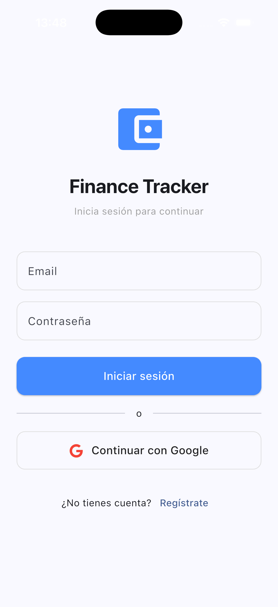
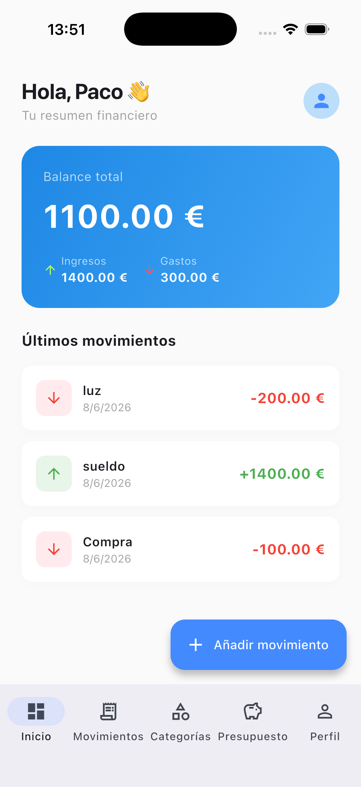
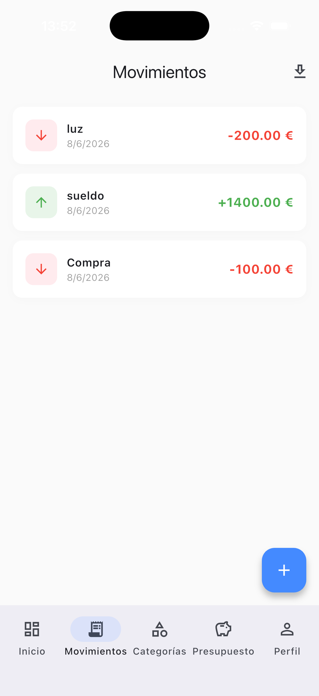
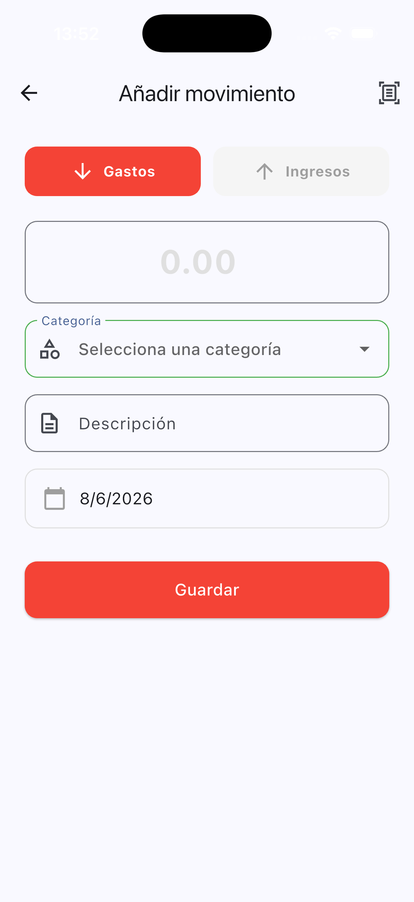
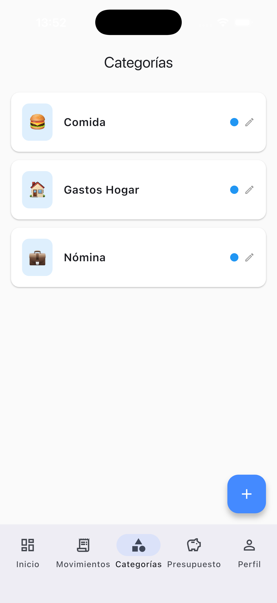
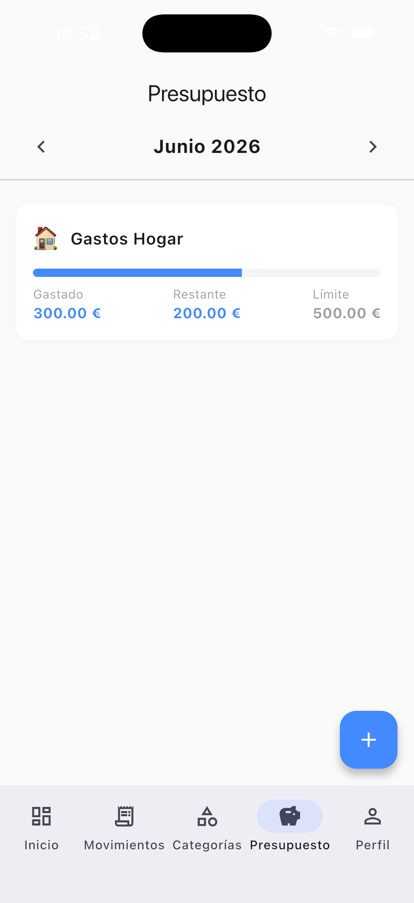
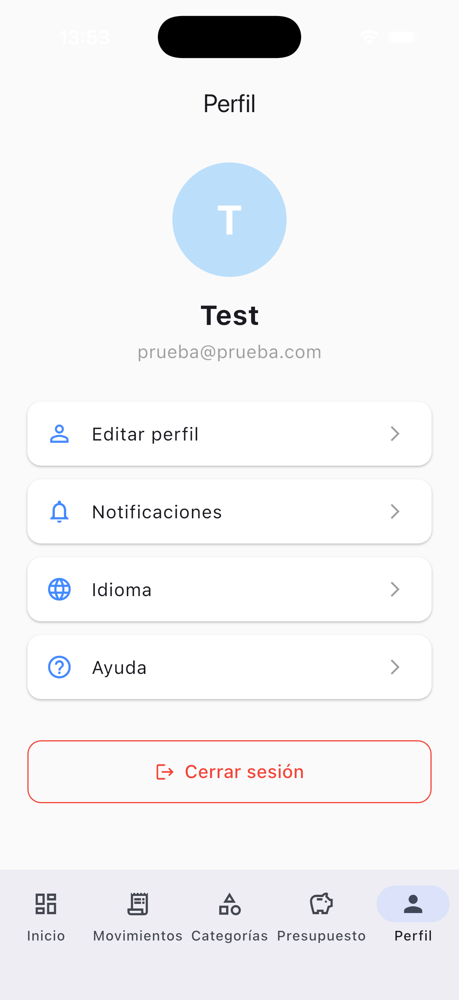

# Finance Tracker

A personal finance management app built as part of the [CastroDev](https://castrodev.com) portfolio. Track your income, expenses, budgets, and categories with a clean and intuitive interface.

---

## 📱 Screenshots

<p align="center">
  
  
  
  
</p>
<p align="center">
  
  
  
</p>

---

## ✨ Features

- 📊 **Dashboard** — Real-time balance, income/expense summary and latest transactions
- 💸 **Transactions** — Create, view and delete transactions with category assignment
- 📁 **Categories** — Custom categories with icons and colors
- 🎯 **Budgets** — Monthly budget tracking with visual progress bars
- 📄 **Export** — Export transactions to PDF or Excel
- 📷 **OCR Scan** — Scan receipts automatically with Google Cloud Vision
- 👤 **Profile** — Edit name, manage notifications and switch language
- 🌍 **Multilingual** — English and Spanish support

---

## 🛠️ Tech Stack

| Layer | Technology |
|---|---|
| Framework | Flutter |
| State Management | Riverpod |
| Error Handling | fpdart (Either) |
| Models | Freezed + json_serializable |
| Networking | Dio |
| Authentication | Firebase Auth (Email + Google) |
| Backend | .NET 10 REST API (Clean Architecture) |
| Database | Cloud Firestore |
| Infrastructure | Google Cloud Run |

---

## 🏗️ Architecture

The app follows **Clean Architecture** principles with strict layer separation:

```
lib/
├── core/
│   ├── config/          # API and app configuration
│   ├── errors/          # Failure types (fpdart)
│   └── network/         # Dio client with Firebase auth
└── features/
    ├── auth/            # Login, register, Google Sign-In
    ├── transactions/    # CRUD, export PDF/Excel, OCR scan
    ├── categories/      # CRUD with icon and color picker
    ├── budgets/         # Monthly budget tracking
    ├── home/            # Dashboard and navigation
    └── profile/         # Settings, notifications, language
```

Each feature follows the pattern:
```
feature/
├── data/
│   ├── datasources/     # Remote API calls
│   ├── models/          # Freezed + JSON models
│   └── repositories/    # Repository implementations
├── domain/
│   ├── entities/        # Freezed domain entities
│   ├── repositories/    # Abstract repository interfaces
│   └── usecases/        # Business logic use cases
└── presentation/
    ├── pages/           # Screen widgets
    ├── providers/       # Riverpod state notifiers
    └── widgets/         # Reusable UI components
```

---

## 🚀 Getting Started

### Prerequisites

- Flutter SDK
- Firebase project configured
- API running at `api.castrodev.com` or locally

### Installation

```bash
# Clone the repository
git clone https://github.com/castrodev/finance-tracker.git

# Install dependencies
flutter pub get

# Generate code
dart run build_runner build --delete-conflicting-outputs
flutter gen-l10n

# Run the app
flutter run --dart-define=API_URL=https://api.castrodev.com
```

---

## 🔗 Related

- [CastroDev API](https://github.com/castrodev/castrodev-api) — Shared .NET 10 backend
- [castrodev.com](https://castrodev.com) — Portfolio

---

## 📄 License

MIT © [Gabriel Castro](https://castrodev.com)

---

---

# Finance Tracker

Aplicación de gestión de finanzas personales desarrollada como parte del portfolio de [CastroDev](https://castrodev.com). Controla tus ingresos, gastos, presupuestos y categorías con una interfaz limpia e intuitiva.

---

## ✨ Funcionalidades

- 📊 **Dashboard** — Balance en tiempo real, resumen de ingresos/gastos y últimos movimientos
- 💸 **Movimientos** — Crear, ver y eliminar transacciones con asignación de categoría
- 📁 **Categorías** — Categorías personalizadas con iconos y colores
- 🎯 **Presupuestos** — Seguimiento mensual con barras de progreso
- 📄 **Exportación** — Exporta movimientos a PDF o Excel
- 📷 **Escaneo OCR** — Escanea facturas automáticamente con Google Cloud Vision
- 👤 **Perfil** — Edita tu nombre, gestiona notificaciones y cambia el idioma
- 🌍 **Multiidioma** — Soporte para español e inglés

---

## 🛠️ Stack Tecnológico

| Capa | Tecnología |
|---|---|
| Framework | Flutter |
| Estado | Riverpod |
| Manejo de errores | fpdart (Either) |
| Modelos | Freezed + json_serializable |
| Red | Dio |
| Autenticación | Firebase Auth (Email + Google) |
| Backend | API REST .NET 10 (Clean Architecture) |
| Base de datos | Cloud Firestore |
| Infraestructura | Google Cloud Run |

---

## 🚀 Instalación

```bash
# Clonar el repositorio
git clone https://github.com/castrodev/finance-tracker.git

# Instalar dependencias
flutter pub get

# Generar código
dart run build_runner build --delete-conflicting-outputs
flutter gen-l10n

# Ejecutar
flutter run --dart-define=API_URL=https://api.castrodev.com
```

---

## 📄 Licencia

MIT © [Gabriel Castro](https://castrodev.com)